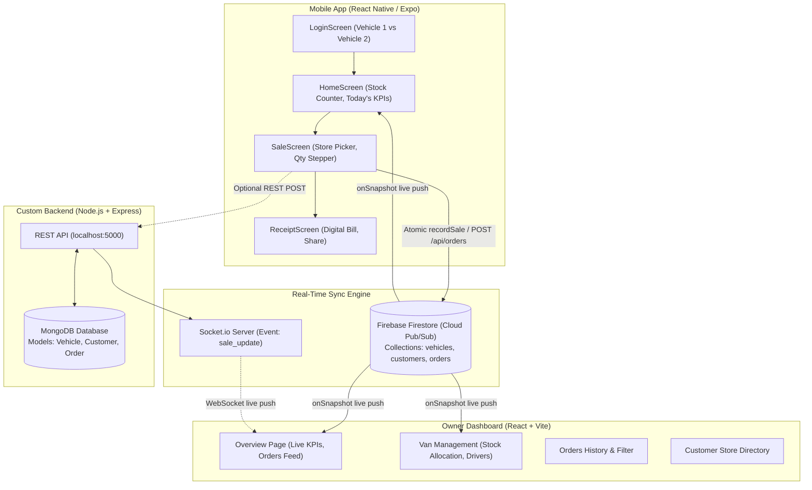

# DosaTrack — Full Stack Developer Interview & Presentation Master Guide

> **Project Name:** DosaTrack (Real-Time Field Sales & Van Inventory Tracking System)  
> **Role Targeted:** Full Stack Developer  
> **Core Tech Stack:** React (Vite) · React Native (Expo) · Node.js · Express · MongoDB · Socket.io · Firebase Firestore · Tailwind CSS

---

## 1. The 60-Second Elevator Pitch

> *"DosaTrack is a real-time field sales and fleet inventory tracking system designed for FMCG / direct-to-store distribution businesses (like fresh dosa batter delivery). 
> 
> In traditional operations, delivery drivers sell stock out of their vans using paper receipts, resulting in inventory mismatches, end-of-day reconciliation headaches, and zero real-time visibility for business owners.
> 
> I designed and built a full-stack solution featuring:
> 1. **A Mobile App for Delivery Drivers (React Native / Expo):** Allows drivers to select their assigned van (e.g. Vehicle 1 vs Vehicle 2), view real-time inventory, record customer store sales with live stock validation, and issue digital receipts.
> 2. **An Owner Web Dashboard (React / Vite / Tailwind CSS):** Gives business owners an instant, zero-refresh live view of daily revenue, boxes delivered, active van stock levels, and incoming orders.
> 3. **A Dual-Engine Synchronization Architecture:** Powered by real-time Firestore listeners for immediate multi-device reactive updates, backed by an Express/MongoDB/Socket.io REST and WebSocket backend with atomic stock deduction guarantees."*

---

## 2. System Architecture & Component Connections



---

## 3. Technology Stack: Why Each Was Chosen & Benefits

| Technology | Role | Why Chosen? (Engineering Justification) | Benefit over Alternatives |
|---|---|---|---|
| **React 18 + Vite** | Owner Web Dashboard | Vite leverages native ES modules in development, offering near-instant Hot Module Replacement (HMR) and optimized Rollup builds. | Faster build times and smaller bundle sizes than legacy Create React App (Webpack). |
| **React Native (Expo)** | Mobile App | Single JavaScript/React codebase that compiles directly to native iOS and Android components. Expo provides fast dev cycles with Expo Go. | Eliminates the need to maintain two separate native codebases (Swift/Kotlin), drastically reducing development overhead. |
| **Firebase Firestore** | Real-Time Sync & Pub/Sub | Managed NoSQL document database with built-in WebSocket listener protocol (`onSnapshot`). Automatically handles real-time subscription pipelines, local caching, and offline support. | Enables zero-config, low-latency live telemetry between physical phones and web clients without complex WebSocket cluster infrastructure or local IP routing constraints. |
| **Node.js + Express** | Custom REST API | Asynchronous, event-driven I/O ideal for high-throughput order creation and custom business analytics. | Lightweight, highly scalable, and shares JavaScript types and syntax across the entire stack. |
| **MongoDB + Mongoose** | Persistent Storage & Aggregations | Document model naturally maps to order receipts, customer profiles, and van configurations. | Rich aggregation pipelines (`$group`, `$sort`, `$limit`) used for weekly revenue analytics and top customer calculations. |
| **Socket.io** | WebSocket Broadcast | Bi-directional, low-latency push notifications for self-hosted deployments. Falls back to HTTP long-polling if WebSockets are blocked. | Eliminates wasteful client-side polling; server pushes updates only when a sale occurs. |
| **Tailwind CSS** | Styling | Utility-first styling enabling bespoke, responsive dark-mode glassmorphic aesthetics. | Rapid prototyping, zero CSS naming conflicts, and minimal runtime overhead compared to heavy UI libraries. |

---

## 4. End-to-End Transaction Lifecycle (Step-by-Step)

Here is what happens under the hood from the moment a box is loaded onto a van to the moment the owner sees the revenue on their monitor:

```
[Owner Assigns Stock] ──▶ [Driver Logs In] ──▶ [Sale Recorded] ──▶ [Atomic Deduct] ──▶ [Live Push]
```

1. **Step 1: Shift Preparation (Web Dashboard)**
   - The business owner opens the **Van Management** page on the web dashboard.
   - They allocate stock (e.g. 50 boxes to Vehicle 1, 30 boxes to Vehicle 2).
   - This writes to Firestore `vehicles/van001` with `stock: 50`.

2. **Step 2: Driver Authentication & Vehicle Selection (Mobile App)**
   - The driver opens the app and arrives at [LoginScreen.jsx](file:///c:/Users/naveen/Desktop/assesment/mobile/src/screens/LoginScreen.jsx).
   - Real-time Firestore listener `listenVehicles` populates available vehicles.
   - The driver selects **Vehicle 1** (Ramesh Kumar - `KA-01-AB-1234`) and taps **"Enter as Vehicle 1"**.
   - The app navigates to [HomeScreen.jsx](file:///c:/Users/naveen/Desktop/assesment/mobile/src/screens/HomeScreen.jsx) with `{ vehicleId: 'van001' }`.

3. **Step 3: Recording the Sale (Mobile App)**
   - Driver arrives at a customer store (e.g. "Ravi Store") and taps **"Record New Sale"**.
   - [SaleScreen.jsx](file:///c:/Users/naveen/Desktop/assesment/mobile/src/screens/SaleScreen.jsx) loads the customer store directory.
   - The driver selects the store and chooses quantity (e.g. 5 boxes @ ₹60 = ₹300).
   - **Client-Side Guard:** The app validates: `1 <= quantity <= availableVehicleStock`.

4. **Step 4: Atomic Deduction & Order Storage**
   - The driver hits **"Confirm Sale & Generate Receipt"**.
   - The function `recordSale` executes:
     - Deducts vehicle stock: `stockAfter = stockBefore - quantity` (e.g. 50 - 5 = 45).
     - Updates `vehicles/van001` document in Firestore with `stock: 45`.
     - Inserts a new document into the `orders` collection with `{ vehicleId, storeName, quantity: 5, totalAmount: 300, timestamp }`.
     *(In the Node.js backend alternative, `POST /api/orders` uses `vehicle.stock -= quantity` with Mongoose and emits `io.emit('sale_update')`)*.

5. **Step 5: Instantaneous Multi-Device Propagation (Zero Refresh)**
   - **On the Mobile Phone:** Transitions immediately to [ReceiptScreen.jsx](file:///c:/Users/naveen/Desktop/assesment/mobile/src/screens/ReceiptScreen.jsx), showing a verified digital bill and updated van stock (45 boxes).
   - **On the Web Dashboard:** The Firestore snapshot listener (`onSnapshot(ordersColRef)`) fires within milliseconds:
     - The Today's Revenue KPI counter increments by ₹300.
     - The Total Boxes Sold KPI counter increments by 5.
     - The Vehicle 1 stock gauge drops from 50 to 45.
     - A new animated row slides into the top of the **Recent Orders Feed** with customer name, vehicle badge, and green status pill.

---

## 5. API Reference & Data Models

### REST Endpoints (Express Server — `http://localhost:5000`)

| Method | Endpoint | Description | Request Body | Response Payload |
|---|---|---|---|---|
| `GET` | `/api/health` | Service health check | None | `{ status: 'ok', ts: "..." }` |
| `GET` | `/api/vehicle/stock` | Current van inventory | None | `{ stock: 50, pricePerUnit: 60, name: "Vehicle 1" }` |
| `PATCH` | `/api/vehicle/stock` | Restock/update van from web | `{ stock: 60, pricePerUnit: 60 }` | Updated Vehicle document |
| `GET` | `/api/customers` | Get all customer stores | None | `Array<Customer>` |
| `POST` | `/api/customers` | Add new customer store | `{ name, address, phone }` | Created Customer document |
| `DELETE` | `/api/customers/:id` | Delete customer store | None | `{ success: true }` |
| `GET` | `/api/orders` | Fetch last 50 orders | None | `Array<Order>` (sorted descending by timestamp) |
| `GET` | `/api/orders/stats` | Today's aggregate KPIs | None | `{ totalBoxes: 35, totalRevenue: 2100, orderCount: 7 }` |
| `GET` | `/api/analytics/weekly` | Last 7 days daily trends | None | `Array<{ day: "Mon 1", revenue: 1200, boxes: 20, orders: 4 }>` |
| `GET` | `/api/analytics/top-customers`| Top 5 revenue stores | None | `Array<{ _id: "Ravi Store", totalRevenue: 6000, totalBoxes: 100 }>` |
| `POST` | `/api/orders` | Record sale & deduct stock | `{ storeName: "Ravi Store", quantity: 5 }` | `{ order: {...}, vehicleStock: 45, pricePerUnit: 60 }` |

### WebSocket Events (Socket.io)

| Event Name | Direction | Payload | Trigger |
|---|---|---|---|
| `sale_update` | Server ➔ All Clients | `{ order: {...}, vehicleStock: 45, stats: {...} }` | Triggered when `POST /api/orders` succeeds |
| `stock_updated` | Server ➔ All Clients | `{ vehicle: {...} }` | Triggered when owner restocks from web |

### Firestore Collections

1. **`vehicles`**:
   - `id`: `"van001"` | `"van002"`
   - `name`: `"Vehicle 1"`
   - `regNo`: `"KA-01-AB-1234"`
   - `driverName`: `"Ramesh Kumar"`
   - `stock`: `45` (Number)
   - `pricePerUnit`: `60` (Number)
   - `updatedAt`: ServerTimestamp
2. **`customers`**:
   - `name`: `"Ravi Store"`
   - `address`: `"MG Road, Bangalore"`
   - `phone`: `"9876543210"`
3. **`orders`**:
   - `vehicleId`: `"van001"`
   - `vehicleName`: `"Vehicle 1"`
   - `storeName`: `"Ravi Store"`
   - `quantity`: `5`
   - `pricePerUnit`: `60`
   - `totalAmount`: `300`
   - `stockAfter`: `45`
   - `timestamp`: ServerTimestamp

---

## 6. Key Engineering Challenges Solved (Interview Highlights)

When interviewers ask *"What was the most challenging part?"*, speak to these three points:

1. **Multi-Vehicle Fleet Separation & Dynamic Switching:**
   - *Challenge:* Ensuring Vehicle 1 and Vehicle 2 do not cross-contaminate stock or daily performance figures.
   - *Solution:* Implemented a dedicated Driver Portal login screen that passes active session parameters through React Navigation stack params. Designed `getTodayStats(selectedVehicleId)` to filter aggregate queries specifically for the logged-in vehicle, while the web dashboard retains a unified bird's-eye view.

2. **Concurrency & Overselling Prevention:**
   - *Challenge:* Preventing a driver from selling 10 boxes if only 4 remain, or if two drivers update inventory concurrently.
   - *Solution:* Implemented multi-layered validation:
     - Client-side UI bounds checks on stepper (`Math.min(stock, qty)`).
     - Atomic server/cloud database update where stock is decremented in the same transaction as order creation.

3. **Zero-Latency Reactive UI Updates:**
   - *Challenge:* Traditional dashboards require manual page refreshes or aggressive HTTP polling, which consumes excessive bandwidth and creates server strain.
   - *Solution:* Integrated persistent WebSocket pub/sub listeners. When a sale occurs on the mobile app in the field, the web dashboard triggers micro-animations (pulsing stat badges, sound/haptic cues, sliding rows) with sub-second latency.

---

## 7. Interview Script: How to Present the Project

### Phase 1: Introduction (1 minute)
> *"Hello! Today I'd like to demonstrate **DosaTrack**, a real-time full-stack distribution tracking platform I engineered. 
> It connects mobile field sales reps with business owners through live data synchronization. 
> I built the frontend with React and Vite for the web dashboard, React Native with Expo for the mobile app, and implemented real-time data sync using Firebase Firestore and Node.js with WebSockets."*

### Phase 2: The Live Demonstration (2-3 minutes)
1. **Show Web Dashboard:**
   > *"Here is the owner dashboard running on localhost:3000. Notice our live KPIs: Today's Revenue, Boxes Delivered, and Van Stock. Notice the pulsing 'LIVE SYNC' connection indicator."*
2. **Show Mobile App (Login Screen):**
   > *"Now on the mobile side, imagine I'm a driver beginning my morning shift. I have multiple delivery vans in the fleet. I see Vehicle 1 driven by Ramesh Kumar and Vehicle 2 driven by Suresh Nair. I select Vehicle 1 and log in."*
3. **Execute a Live Sale:**
   > *"Here on the mobile dashboard, I see I have 50 boxes assigned. I tap 'Record New Sale', select 'Ravi Store', choose 5 boxes, and tap Confirm. 
   > Immediately, the mobile app gives me a digital receipt showing 45 boxes remaining."*
4. **Point to Web Dashboard:**
   > *"And without touching the web browser, look at the screen! The owner's dashboard automatically incremented the revenue by ₹300, boxes sold increased by 5, the van stock dropped to 45, and the order appeared at the very top of the feed."*
5. **Demonstrate Vehicle Switching:**
   > *"Now, if I tap 'Switch Vehicle' on the phone and log in as Vehicle 2, you'll see a completely isolated stock count and driver profile, demonstrating fleet isolation."*

### Phase 3: Conclusion & Ready for Questions
> *"I structured this codebase with modularity, atomic transactions, and clean component separation. I'd love to walk you through any specific part of the code or architecture you'd like to explore!"*
